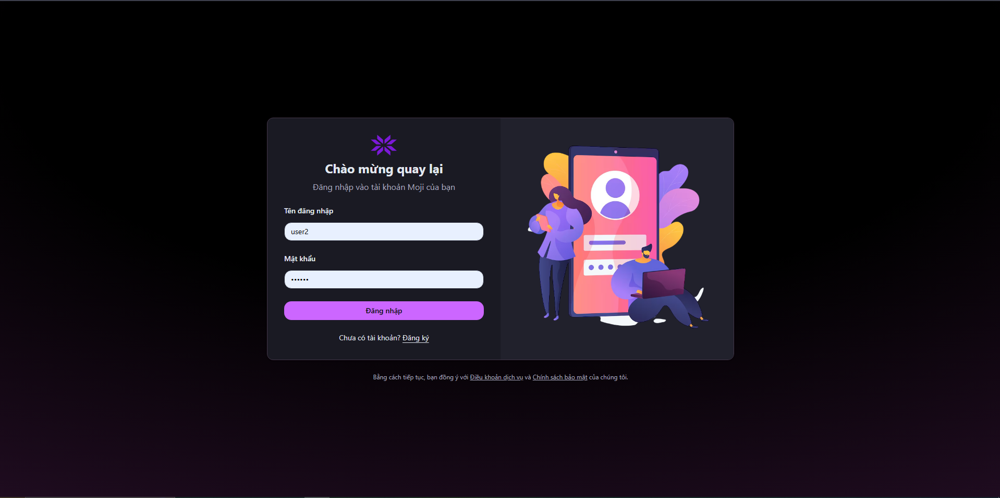
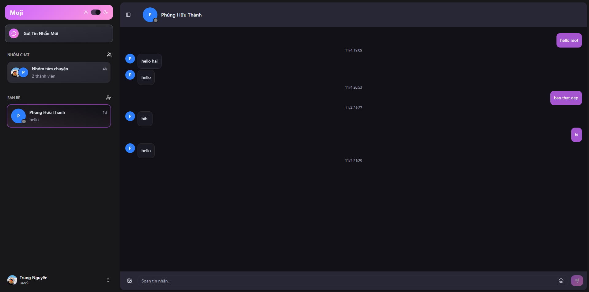
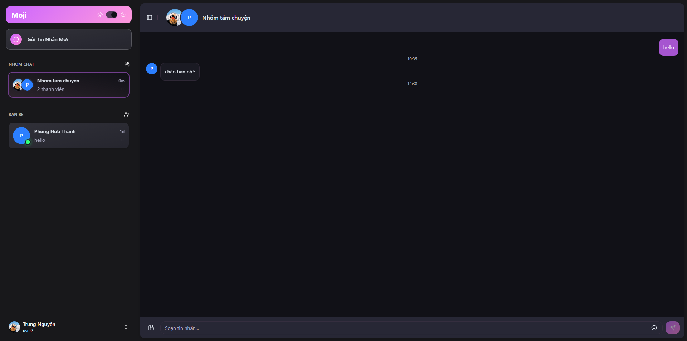
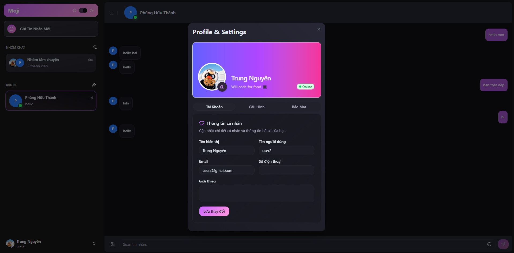

# Moji Chat

Ứng dụng chat realtime fullstack, hỗ trợ nhắn tin trực tiếp, chat nhóm, quản lý bạn bè và cập nhật hồ sơ người dùng.

## **Ứng dụng nhắn tin real-time**

[](https://react.dev/)
[](https://www.typescriptlang.org/)
[](https://nodejs.org/)
[](https://www.mongodb.com/)
[](https://socket.io/)

## Demo Screenshots

| Đăng nhập | Chat trực tiếp |
|---|---|
|  |  |
| Chat nhóm | Hồ sơ người dùng |
|  |  |

## ✨ Điểm nổi bật

- 🔐 Xác thực người dùng với `access token` + `refresh token`
- ⚡ Realtime messaging bằng `Socket.IO`
- 💬 Hỗ trợ chat `direct` và `group`
- 🤝 Quản lý lời mời kết bạn (gửi, chấp nhận, từ chối)
- ♻️ Tự động refresh token khi access token hết hạn
- 🖼️ Upload avatar lên Cloudinary
- 🎨 Giao diện hiện đại với React, Tailwind và Zustand

## 🛠️ Công nghệ sử dụng

### Frontend
- React + TypeScript + Vite
- Zustand (state management)
- React Router
- Socket.IO Client
- Tailwind CSS + shadcn/ui
- Axios

### Backend
- Node.js + Express
- MongoDB + Mongoose
- Socket.IO
- JWT + bcrypt
- Cookie Parser + CORS
- Multer + Cloudinary

## 🗂️ Cấu trúc thư mục

```bash
moji-chat/
├── backend/        # API server + Socket.IO + MongoDB models
├── frontend/       # React app
└── screenshots/    # Ảnh minh họa giao diện
```

## 🔄 Luồng hoạt động chính

1. Người dùng đăng ký/đăng nhập tại frontend.
2. Backend phát hành `access token` (JWT) và lưu `refresh token` trong cookie `httpOnly`.
3. Frontend dùng Axios interceptor để gắn token vào request.
4. Khi token hết hạn, frontend tự động gọi API refresh để lấy token mới.
5. Sau khi đăng nhập, frontend kết nối Socket.IO để nhận:
   - trạng thái online/offline
   - tin nhắn mới realtime
   - trạng thái đã xem tin nhắn
   - sự kiện nhóm chat mới

## 🚀 Cài đặt và chạy local

### 1) Clone repository

```bash
git clone <your-repo-url>
cd moji-chat
```

### 2) Cài dependencies

```bash
cd backend
npm install

cd ../frontend
npm install
```

### 3) Cấu hình biến môi trường

Tạo file `.env` trong `backend`:

```env
PORT=5001
MONGODB_URI=your_mongodb_connection_string
ACCESS_TOKEN_SECRET=your_access_token_secret
CLIENT_URL=http://localhost:5173

CLOUDINARY_CLOUD_NAME=your_cloud_name
CLOUDINARY_API_KEY=your_api_key
CLOUDINARY_API_SECRET=your_api_secret
```

Tạo file `.env.development` trong `frontend`:

```env
VITE_API_URL=http://localhost:5001/api
VITE_SOCKET_URL=http://localhost:5001/
```

### 4) Chạy dự án

Mở 2 terminal:

```bash
# Terminal 1
cd backend
npm run dev
```

```bash
# Terminal 2
cd frontend
npm run dev
```

Frontend chạy mặc định tại `http://localhost:5173`  
Backend chạy mặc định tại `http://localhost:5001`

## 📡 API chính

- `POST /api/auth/signup`
- `POST /api/auth/signin`
- `POST /api/auth/signout`
- `POST /api/auth/refresh`
- `GET /api/users/me`
- `GET /api/users/search`
- `POST /api/users/uploadAvatar`
- `GET /api/friends`
- `GET /api/friends/requests`
- `POST /api/friends/requests`
- `POST /api/friends/requests/:requestId/accept`
- `POST /api/friends/requests/:requestId/decline`
- `POST /api/conversations`
- `GET /api/conversations`
- `GET /api/conversations/:conversationId/messages`
- `PATCH /api/conversations/:conversationId/seen`
- `POST /api/messages/direct`
- `POST /api/messages/group`

## 📜 Scripts hữu ích

### Backend
- `npm run dev` - chạy server với nodemon
- `npm start` - chạy server production mode

### Frontend
- `npm run dev` - chạy Vite dev server
- `npm run build` - build production
- `npm run preview` - preview bản build
- `npm run lint` - kiểm tra lint

## 🔒 Ghi chú bảo mật

- Không commit file `.env` chứa khóa bí mật.
- Nên xoay vòng (rotate) các secret nếu đã từng lộ ra môi trường công khai.

## 👨‍💻 Tác giả

Moji Chat được xây dựng như một dự án học tập/thực hành fullstack realtime chat.
